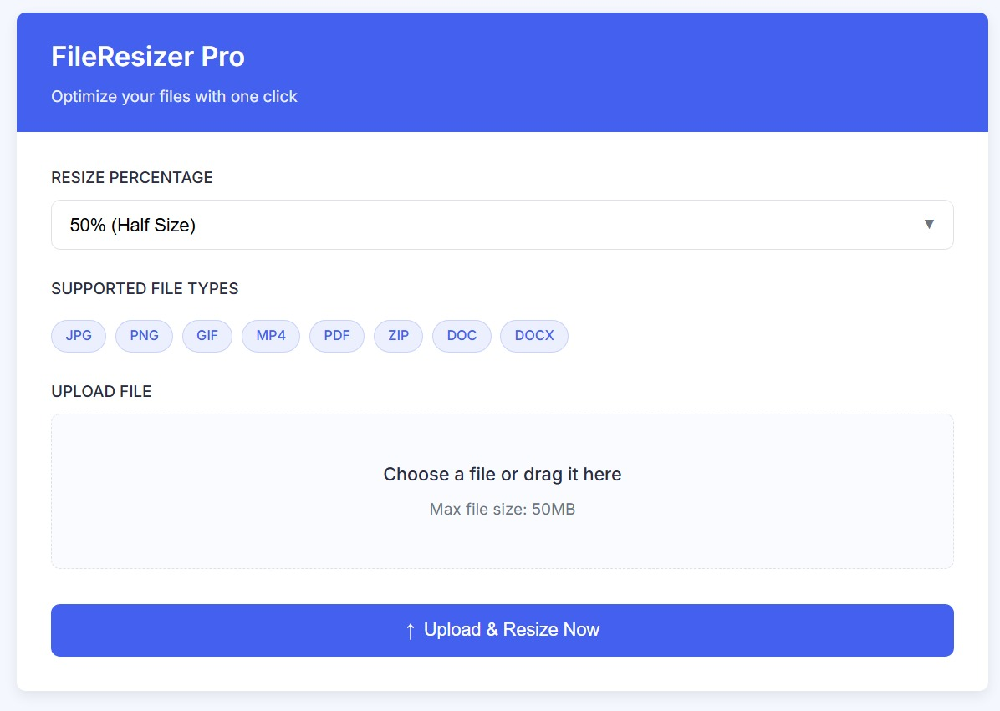

## 📦 Resize File Online

Resize File Online adalah aplikasi web berbasis PHP yang memungkinkan pengguna mengunggah berbagai jenis file dan mengecilkan ukurannya (resize) secara cepat dan praktis. Aplikasi ini mendukung file gambar, dokumen, arsip, hingga video.

---

### 🚀 Fitur Utama

* **Upload file** hingga 50MB
* Mendukung format:

  * JPG, JPEG, PNG, GIF
  * MP4, MOV
  * PDF, ZIP
  * DOC, DOCX
* Pilihan persentase resize:

  * 10%, 25%, 50%, 75%, 90%
* Proses resize gambar langsung di server
* Untuk video, file tetap diunggah, tetapi resize memerlukan FFMPEG (belum diimplementasikan)
* File selain gambar/video akan disalin sebagai file kompresi (tanpa resize)
* Hasil resize dapat diunduh langsung

---

### 🖥️ Cara Instalasi

1. **Clone repo:**

   ```bash
   git clone https://github.com/wahyuardiansyah6677/ResizeTools
   ```

2. **Pindah ke folder proyek:**

   ```bash
   cd ResizeTools
   ```

3. Pastikan server mendukung PHP dan ekstensi `GD` aktif.

4. Jalankan aplikasi pada server lokal atau hosting dengan mengakses `tools.php` di browser.

---

### ⚙️ Cara Menggunakan

1. Buka halaman `tools.php` di browser.
2. Pilih persentase resize (misalnya 50%).
3. Pilih file yang ingin diresize.
4. Klik **Upload & Resize File Sekarang**.
5. Setelah proses selesai:

   * Jika sukses, akan muncul tombol download file hasil resize.
   * Jika gagal, muncul pesan error.

---

### 📁 Struktur Folder

```
/uploads          # Menyimpan file asli hasil upload
/resized          # Menyimpan file hasil resize
/tools.php        # File utama aplikasi
```

---

### ⚠️ Catatan

* Untuk file video (MP4, MOV), proses resize belum berjalan karena memerlukan FFMPEG.
* Untuk PDF, ZIP, DOC, dan DOCX, sistem hanya meng-copy file sebagai bentuk kompresi (tanpa resize).

---

### 📄 License

Proyek ini bersifat open source dan dapat digunakan sesuai kebutuhan.

---

**Tampilan Aplikasi:**


